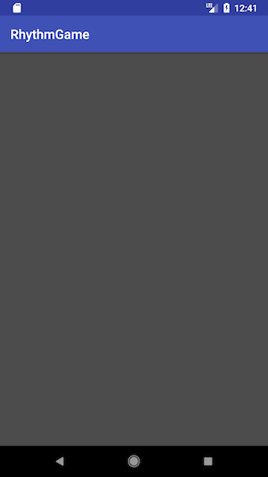
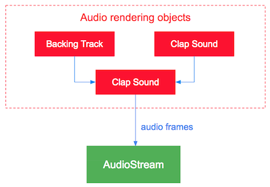
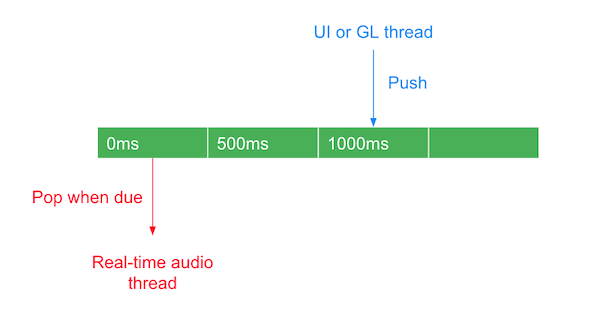

Rhythm Game sample
==================

This sample demonstrates how to build a simple musical game. The objective of the game is to copy the clap patterns you hear by tapping on the screen.

For a step-by-step guide on how this game works and how to build it check out this codelab: [Build a Musical Game using Oboe](https://codelabs.developers.google.com/codelabs/musicalgame-using-oboe/index.html)

Screenshots
-----------
The UI is deliberately very simple - just tap anywhere in the grey area after hearing the claps.

### Audio timeline

The game plays the clap sounds on the first 3 beats of the bar. These are played in time with the backing track.

 When the user taps on the screen, a clap sound is played and the game checks whether the tap occurred within an acceptable time window.

### Architecture

Oboe provides the [`AudioStream`](https://github.com/google/oboe/blob/master/include/oboe/AudioStream.h) class and associated objects to allow the sample to output audio data to the audio device. All other objects are provided by the sample.

Each time the `AudioStream` needs more audio data it calls [`AudioDataCallback::onAudioReady`](https://github.com/google/oboe/blob/master/include/oboe/AudioStreamCallback.h). This passes a container array named `audioData` to the `Game` object which must then fill the array with `numFrames` of audio frames.

### Latency optimizations
The sample uses the following optimizations to obtain a low latency audio stream:

- Performance mode set to [Low Latency](https://github.com/google/oboe/blob/master/FullGuide.md#setting-performance-mode)
- Sharing mode set to [Exclusive](https://github.com/google/oboe/blob/master/FullGuide.md#sharing-mode)
- Buffer size set to twice the number of frames in a burst (double buffering)

### Audio rendering

The `IRenderableAudio` interface (abstract class) represents objects which can produce frames of audio data. The `Player` and `Mixer` objects both implement this interface.

Both the clap sound and backing tracks are represented by `Player` objects which are then mixed together using a `Mixer`.

### Sharing objects with the audio thread

It is very important that the audio thread (which calls the `onAudioReady` method) is never blocked. Blocking can cause underruns and audio glitches. To avoid blocking we use a `LockFreeQueue` to share information between the audio thread and other threads. The following diagram shows how claps are enqueued by pushing the clap times (in frames) onto the queue, then dequeuing the clap time when the clap is played.

We also use [atomics](http://en.cppreference.com/w/cpp/atomic/atomic) to ensure that threads see a consistent view of any shared primitives.

### Keeping UI events and audio in sync

When a tap event arrives on the UI thread it only contains the time (milliseconds since boot) that the event occurred. We need to figure out how far along the audio track was when the tap occurred. Put another way, we need to convert milliseconds since boot to audio frames.

To do this we use a reference point which stores the current frame number in the audio timeline and the milliseconds since boot  which the frame was rendered. This reference point is updated each time the `onAudioReady` method is called. This enables us to keep the UI in sync with the audio timeline.

### Caveats and limitations
- The game will only work with audio devices which have a sample rate of 48,000 samples per second and 2 output channels (stereo). Overcoming this limitation requires either resampling the raw PCM files to match the target audio device, or resampling the audio data on-the-fly before sending it to the audio stream. A later version of this sample may include this feature.

